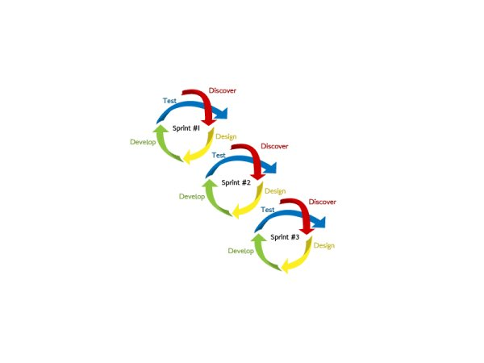

---

layout: default

style: |

    .images.row img {
      width: 300px;
    }

---

# Яндекс

## **{{ site.presentation.title }}** {#cover}

    
{{ site.presentation.service }}





	
<a href="{{ site.author.link }}">{{ site.author.name }}</a>,   {{ site.author.position }}

    
#yasubbotnik, Москва, 17 октября 2015 года

## 
{:.cover .w}

## 
{:.cover .w}

## **Задача и метрики**

## 
{:.cover .w}

## 
{:.cover .w}

## Задачи

* привлечение новых пользователей
* вход в свой Диск

## Метрика

* CTR кнопок «Завести Диск» и «зарегистрироваться» в форме логина

## Простой эксперимент

    <% if experiment %>
        <video poster="<%= preview %>">
            <source src="<%= video %>" />
        </video>
    <% else %>
        " />
    <% endif %>

## **Что нужно учитывать**

## Однородность контрольной выборки

* Показываем один и тот же вариант каждой группе пользователей
* ...Не показываем видео, если не смогли загрузить в течении 2 секунд (считаем канал слабым)
* ...Не показываем видео на мобильных (считаем канал слабым)

## Время проведения эксперимента

* Нужно подождать пока приборы «успокоятся»
* ...В нашем случае, проводили эксперимент в течении **1 месяца**

## Результаты

> CTR кнопки «Завести свой Диск»

| Видео | on       | off      |
+-------|----------|----------|
| CTR   | **7.04%**| **7.86%**|
+-------|----------|----------+

> CTR кнопки «зарегистрироваться»

| Видео | on       | off      |
+-------|----------|----------|
| CTR   | 1.75%    | **1.98%**|
+-------|----------|----------+

## Более сложный эксперимент
{:.images .row}

## 
{:.cover .h}

## 
{:.cover .h}

## 
{:.cover .h}

## Выводы

* Четко сформулировать цель и определить метрики
* ...Проводить эксперименты для проверки своих гипотез

## **Контакты** {#contacts}

    
{{ site.author.name }}

    
{{ site.author.position }}

    

        
vitkarpov@yandex-team.ru

        <!-- 
@twitter
 -->
        <!-- 
vitkarpov
 -->
        
vitkarpov

    

